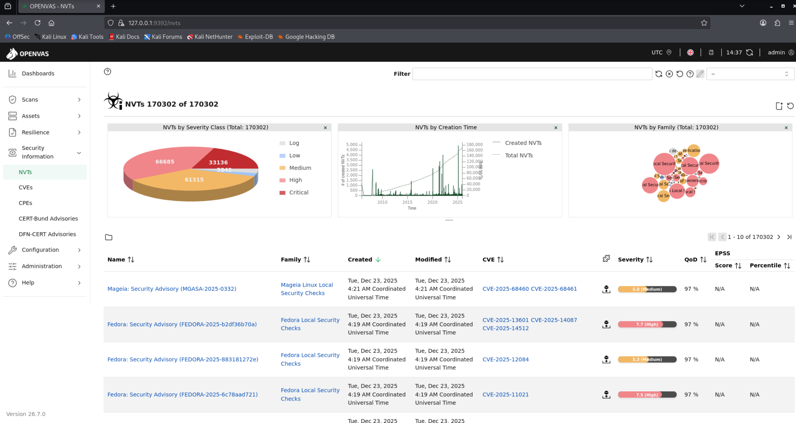

# Guía de Escaneos en OpenVAS

OpenVAS es una herramienta de escaneo de vulnerabilidades muy completa, usada para evaluar la seguridad de sistemas y redes. Esta guía cubre desde escaneos básicos hasta más avanzados.

## Guía completa y estable para instalar **GVM / OpenVAS** en **Kali Linux (Rolling)**

> Esta guía está basada en una instalación **real**, resolviendo problemas comunes de Kali (PostgreSQL, Redis, feeds, sockets y CVE).
> **Objetivo:** terminar con *Security Information* lleno y CVE visibles, sin errores.


---

### 🧩 Requisitos previos

* Kali Linux **rolling** actualizado
* Usuario con permisos `sudo`
* Conexión a Internet estable
* **Paciencia** (la primera sincronización tarda)

---

### 1️⃣ Actualizar el sistema (OBLIGATORIO)

```bash
sudo apt update
sudo apt upgrade -y
```

**Qué hace:**

* Actualiza listas de paquetes
* Evita incompatibilidades (muy importante en Kali rolling)

Si hay errores de `dpkg`, resolverlos **antes de continuar**:

```bash
sudo dpkg --configure -a
sudo apt --fix-broken install
```

---

### 2️⃣ Instalar PostgreSQL 18 (REQUERIDO por GVM 25.x)

```bash
sudo apt install -y postgresql-18
```

**Por qué:**

* GVM **NO funciona** con PostgreSQL 17
* Kali puede tener 17 por defecto

---

### 3️⃣ Crear el cluster de PostgreSQL 18

```bash
sudo systemctl stop postgresql
sudo pg_createcluster 18 main --start
```

**Qué hace:**

* Crea el clúster de base de datos que usará GVM

Verifica:

```bash
pg_lsclusters
```

Debe verse algo como:

```
18  main  5433 online
```

---

### 4️⃣ Mover PostgreSQL 18 al puerto 5432 (CRÍTICO)

GVM **exige** PostgreSQL 18 en el puerto **5432**.

```bash
sudo systemctl stop postgresql
sudo sed -i 's/port = 5433/port = 5432/' /etc/postgresql/18/main/postgresql.conf
sudo systemctl start postgresql
```

Verifica:

```bash
pg_lsclusters
```

Debe decir:

```
18  main  5432 online
```

---

### 5️⃣ Eliminar clusters antiguos (si existen)

Si existe PostgreSQL 17:

```bash
sudo pg_dropcluster --stop 17 main
```

**Por qué:**

* Evita que GVM se conecte a la versión incorrecta

---

### 6️⃣ Instalar GVM

```bash
sudo apt install -y gvm
```

**Qué hace:**

* Instala gvmd, OpenVAS, GSA, Redis y dependencias

---

### 7️⃣ Configuración inicial (PASO MÁS IMPORTANTE)

```bash
sudo gvm-setup
```

⚠️ **NO interrumpir**:

* No cerrar terminal
* No reiniciar
* No ejecutar otros comandos

⏱️ Puede tardar **30–60 minutos** la primera vez.

Durante este paso:

* Se crean certificados
* Se crea la base de datos
* Se crea el usuario `admin`
* Se descargan feeds (NVT, SCAP, CVE, CERT)

Al final debe aparecer:

```
[+] Done
```

👉 **Guardar la contraseña del usuario admin** que se muestra.

---

### 8️⃣ Activar Redis (AJUSTE NECESARIO EN KALI)

```bash
sudo systemctl start redis-server
sudo systemctl enable redis-server
```

**Por qué:**

* Redis es obligatorio para OpenVAS
* En Kali no siempre queda habilitado

Verificar:

```bash
sudo systemctl status redis-server
```

Debe decir:

```
Active: active (running)
```

---

### 9️⃣ Arrancar GVM

```bash
sudo gvm-start
```

Espera 1–2 minutos.

---

### 🔟 Verificar instalación

```bash
sudo gvm-check-setup
```

Resultado esperado:

```
It seems like your GVM installation is OK.
```

⚠️ Advertencias sobre *password policy* son normales y opcionales.

---

### 🌐 Acceso a la interfaz web

En el navegador:

```
https://127.0.0.1:9392
```

* Usuario: `admin`
* Contraseña: la generada en `gvm-setup`

Aceptar el certificado autofirmado.

---

### ⏳ Primera sincronización de feeds

Es normal ver:

> **Feed is currently syncing**

Durante este tiempo:

* No se pueden lanzar escaneos
* *Security Information* puede estar vacío

⏱️ Esperar **10–40 minutos**.

Cuando termine:

* El mensaje desaparece
* *Security Information* se llena (CVE, CPE, OVAL)

---

### ✅ Comprobación final (CLAVE)

En la web:

* **Security Information → CVEs** → deben verse miles
* Crear un escaneo *Full and Fast*
* En los resultados → **References → CVE-XXXX-YYYY**

👉 Esto confirma que **los CVE funcionan correctamente**.

---

### 🧠 Notas importantes (experiencia real)

* ❌ No ejecutar `gvmd --rebuild`
* ❌ No tocar `/run/ospd`
* ❌ No reinstalar feeds manualmente tras el setup
* ✔ Usar solo:

  ```bash
  gvm-start
  gvm-stop
  gvm-check-setup
  ```

## Escaneo básico

### Crear un Target
- Configuration → Targets → New Target
- Define nombre e IP o rango de IPs

### Crear un Task
- Scans → Tasks → New Task
- Scan Config: **Full and fast**
- Ejecuta el escaneo

### Revisar resultados
- Scans → Results
- Analiza severidades y CVEs

---

## Escaneo intermedio / pro

### Configuración avanzada
- Scan Config: **Full and fast ultimate**
- Port List: **All TCP and UDP**

### Escaneo autenticado
- Añade credenciales (SSH / SMB)
- Permite detección profunda de vulnerabilidades

### Ajustes agresivos
- Incrementa hosts concurrentes
- Reduce timeouts
- ⚠️ Puede afectar redes productivas

---

## Buenas prácticas

- Escanea solo con autorización
- Evita entornos productivos
- Exporta reportes (PDF / HTML / CSV)

---

## Comandos útiles

Actualizar feeds:
```bash
sudo gvm-feed-update
```

Comprobar estado:
```bash
sudo gvm-check-setup
```

---


### Sobre sockets

* En versiones modernas **NO es obligatorio** ver `ospd-openvas-vt.sock`
* Que *Security Information* esté lleno es la prueba real

---

## 🏁 Resultado final

✔ GVM funcionando correctamente
✔ CVE visibles
✔ Escaneos habilitados
✔ Instalación estable en Kali Rolling

---

## Referencias

- https://www.greenbone.net/en/community-edition/
- https://www.openvas.org

**Fin de la guía.**